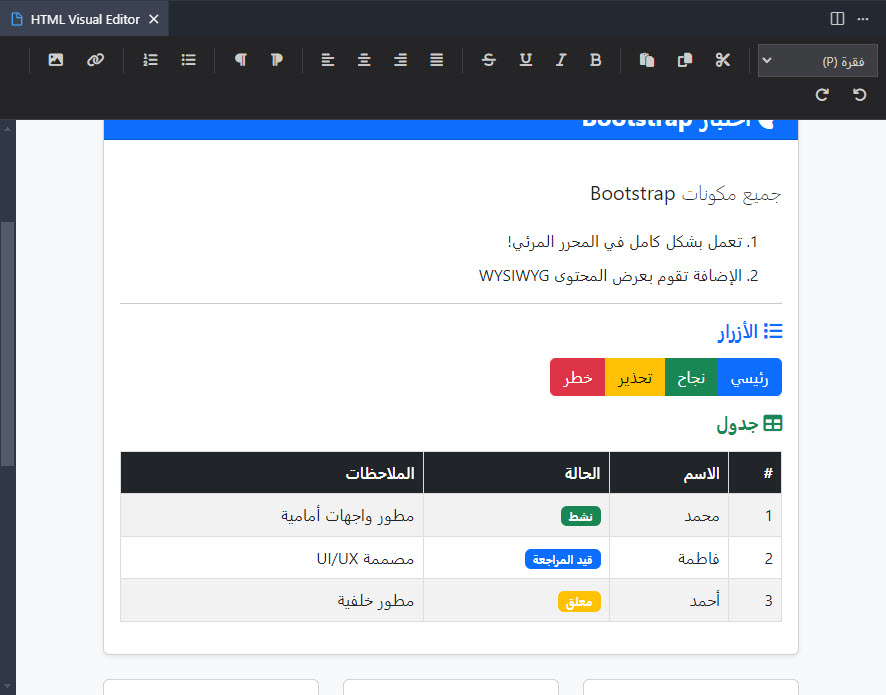

# HTML WYSIWYG Editor for VS Code / Cursor



## 📝 الوصف

محرر HTML مرئي بسيط وسريع لـ VS Code و Cursor IDE. يوفر واجهة بديهية لتحرير ملفات HTML مع تزامن ثنائي الاتجاه.

## ✨ الميزات

### 🎨 واجهة المستخدم
- ✅ **محرر بسيط وسريع** - بدون تبعيات خارجية ثقيلة
- ✅ **أيقونات Font Awesome** - واجهة احترافية وواضحة
- ✅ **واجهة نظيفة** - بدون هوامش أو حدود غير ضرورية
- ✅ **أزرار تفاعلية** - تتغير حالتها بناءً على التنسيق الحالي

### 🔄 التزامن والحفظ
- ✅ **تزامن ثنائي الاتجاه** - التغييرات في المحرر تنعكس في الملف والعكس
- ✅ **حفظ تلقائي** - جميع التغييرات تُحفظ تلقائياً في ملف HTML
- ✅ **دعم ملفات متعددة** - التبديل التلقائي بين الملفات المفتوحة

### 🌍 دعم اللغات
- ✅ **دعم كامل للعربية** - RTL ودعم Unicode
- ✅ **اتجاه النص** - RTL/LTR مع أزرار مخصصة
- ✅ **محاذاة متقدمة** - يسار، وسط، يمين، مبرر

### 📝 التنسيقات
- ✅ **تنسيقات نصية** - عريض، مائل، تسطير، يتوسطه خط
- ✅ **عناوين** - H1, H2, H3 مع قائمة منسدلة
- ✅ **قوائم** - نقطية ومرقمة
- ✅ **روابط وصور** - إضافة ولصق مباشر
- ✅ **حفظ الصور محلياً** - في مجلد `assets/`

### 🎯 الميزات المتقدمة
- ✅ **دعم CSS الخارجي** - تحميل ملفات CSS و JavaScript
- ✅ **اختصارات لوحة المفاتيح** - Ctrl+B, Ctrl+I, Ctrl+U, Ctrl+Shift+V
- ✅ **أيقونة شريط العنوان** - وصول سريع من محرر VS Code
- ✅ **Toggle للمحاذاة والاتجاه** - الضغط مرة أخرى لإزالة التنسيق

## 🚀 التثبيت

### في Cursor

```
1. Cmd+Shift+P
2. Extensions: Install from VSIX
3. اختر vscode-html-wysiwyg-0.0.1.vsix
4. Reload Window
```

### في VS Code

```bash
code --install-extension vscode-html-wysiwyg-0.0.1.vsix
```

## 📖 الاستخدام

1. افتح ملف HTML
2. اضغط `Cmd+Shift+P` (Mac) أو `Ctrl+Shift+P` (Windows/Linux)
3. اكتب `wysiwyg` أو `WYSIWYG: Open HTML Visual Editor`
4. ابدأ التحرير!

## 🎯 التنسيقات المدعومة

### 📝 تنسيقات النص الأساسية
| التنسيق | الاختصار | الوصف            |
| -------------- | ---------------- | --------------------- |
| **B**   | Ctrl+B           | عريض (Bold)              |
| **I**   | Ctrl+I           | مائل (Italic)              |
| **U**   | Ctrl+U           | تسطير (Underline)            |
| **S**   | -                | يتوسطه خط (Strikethrough)     |

### 📐 المحاذاة والاتجاه
| التنسيق | الوصف            |
| -------------- | --------------------- |
| **⬅️**   | محاذاة لليسار (Left Align) |
| **↔️**   | محاذاة للوسط (Center Align) |
| **➡️**   | محاذاة لليمين (Right Align) |
| **⬌**   | محاذاة مبررة (Justify) |
| **🔄**   | اتجاه RTL (Right-to-Left) |
| **🔄**   | اتجاه LTR (Left-to-Right) |

### 📋 العناوين والقوائم
| التنسيق | الوصف            |
| -------------- | --------------------- |
| **H1**   | عنوان رئيسي (Heading 1) |
| **H2**   | عنوان فرعي (Heading 2)   |
| **H3**   | عنوان فرعي 2 (Heading 3) |
| **•**   | قائمة نقطية (Unordered List) |
| **1.**   | قائمة مرقمة (Ordered List) |

### 🔗 الروابط والوسائط
| التنسيق | الوصف            |
| -------------- | --------------------- |
| **🔗**   | رابط (Link)              |
| **🖼**   | صورة (Image)              |

### ⚡ العمليات
| التنسيق | الاختصار | الوصف            |
| -------------- | ---------------- | --------------------- |
| **⟲**   | Ctrl+Z           | تراجع (Undo)            |
| **⟳**   | Ctrl+Y           | إعادة (Redo)            |
| **✂️**   | Ctrl+X           | قص (Cut)            |
| **📋**   | Ctrl+C           | نسخ (Copy)            |
| **📋**   | Ctrl+V           | لصق (Paste)            |

## 🎨 الميزات التفاعلية

### 🔄 التزامن الذكي
- **الأزرار التفاعلية**: عند الوقوف على نص منسق (عريض، مائل، إلخ)، يتم تمييز الزر المقابل
- **تزامن فوري**: التغييرات تظهر خلال 300 ميلي ثانية
- **حفظ البنية**: يحتفظ بكل تاجات HTML (`<html>`, `<head>`, `<body>`, `<style>`, إلخ)

### 🎯 التحكم المتقدم
- **Toggle للمحاذاة**: الضغط مرة أخرى على زر المحاذاة لإزالة التنسيق
- **Toggle للاتجاه**: الضغط مرة أخرى على زر الاتجاه لإزالة التنسيق
- **حالة الأزرار**: الأزرار تظهر بحالة نشطة عند تطبيق التنسيق
- **اختصارات مخصصة**: Ctrl+Shift+V لفتح المحرر، Ctrl+B/I/U للتحكم

### 🖼️ إدارة الوسائط
- **لصق الصور**: لصق مباشر من الحافظة
- **حفظ تلقائي**: الصور تُحفظ في مجلد `assets/` تلقائياً
- **مسارات نسبية**: استخدام مسارات نسبية في HTML

## 📁 حفظ الصور

عند لصق أو إدراج صورة:

- تُحفظ تلقائياً في مجلد `assets/` بجانب ملف HTML
- يتم إنشاء اسم فريد: `img_YYYY-MM-DDTHH-MM-SS.{ext}`
- يُستخدم مسار نسبي في HTML: ``

## 🔧 المتطلبات

- VS Code 1.90+ أو Cursor
- Node.js 18+ (للتطوير فقط)

## 🛠️ التطوير

```bash
# تثبيت التبعيات
npm install

# البناء
npm run build

# المراقبة
npm run watch

# إنشاء حزمة VSIX
npx @vscode/vsce package --no-dependencies
```

## 📄 الترخيص

MIT License

## 🤝 المساهمة

المساهمات مرحب بها! افتح Issue أو Pull Request.

## 📮 الدعم

إذا واجهت مشكلة، افتح Issue في المستودع.

---

**صُنع بـ ❤️ للمطورين العرب**
